# End-to-End Azure Data Engineering: AdventureWorks Lakehouse

## 📌 Project Overview
This project is a complete end-to-end Data Engineering pipeline built in Microsoft Azure. It processes the famous AdventureWorks retail dataset by building a modern **Data Lakehouse** using the Medallion Architecture (Bronze, Silver, Gold). 

The goal of this project was to take raw, messy CSV files, clean and transform them using PySpark in Azure Databricks, and model them into a massive Star Schema. The final data is served directly to Power BI to create an interactive Executive Sales Dashboard.

---

## 🏗️ Architecture & Azure Services Used

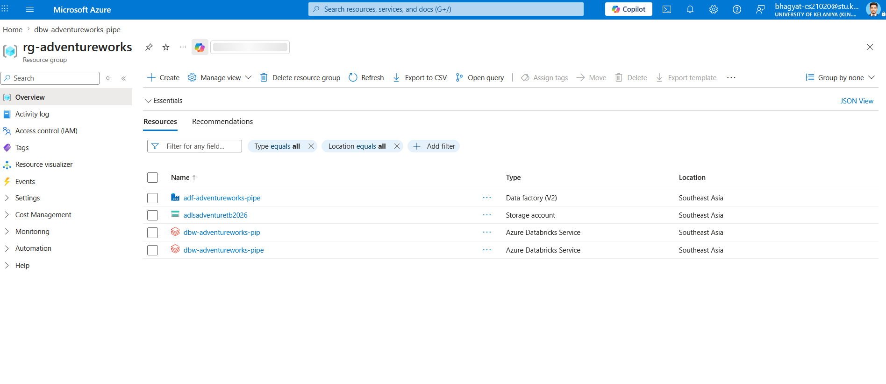

This project utilizes the following cloud technologies:
* **Azure Data Lake Storage Gen2 (ADLS):** The core storage system, divided into Bronze, Silver, and Gold containers.
* **Azure Databricks (PySpark & Spark SQL):** The main computation engine used to clean data, explore schemas, and perform massive table joins.
* **Microsoft Entra ID (Service Principal):** Used for enterprise-grade security and authentication.
* **Delta Lake:** The open-source storage framework used to save tables in the Silver and Gold layers, providing reliability and performance.
* **Power BI:** The visualization tool used to connect to the cloud and build the final business dashboard.

## ⚙️ The Data Workflow (Medallion Architecture)

### 1. 🥉 Bronze Layer (Raw Data Ingestion)
* **What happened:** 10 separate raw CSV files (Sales, Customers, Products, Territories, etc.) were ingested into the Bronze container in Azure Data Lake. 
* **State of data:** Raw, unformatted, and completely separated.

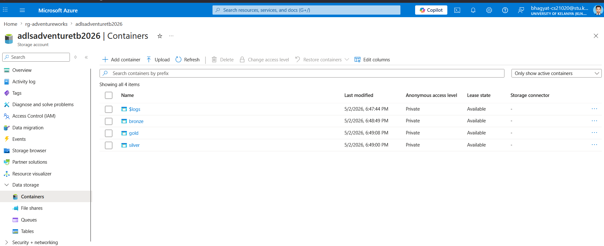

### 2. 🥈 Silver Layer (Cleaning & Automation)
* **What happened:** A PySpark automated loop was built in Databricks. This loop systematically picked up every CSV in the Bronze layer, cleaned the data types, dropped bad records, and saved them as optimized **Delta Tables** in the Silver layer.
* **Schema Exploration:** Before moving to the next step, a custom Python script using Set Intersections was written to scan the Silver tables and automatically identify matching Foreign/Primary keys (e.g., `CustomerKey`, `ProductKey`) across different files.

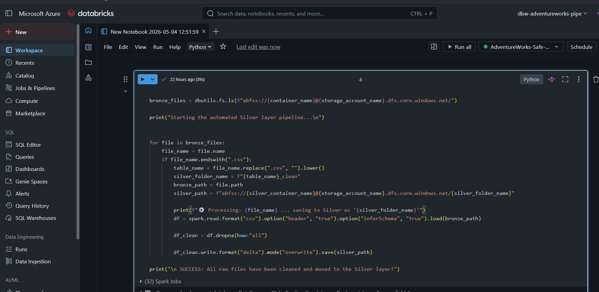

### 3. 🥇 Gold Layer (Star Schema & Business Logic)
* **What happened:** The separated Silver tables were modeled into a **Star Schema**. Three separate years of Sales data were first combined using a PySpark `Union`. Then, a massive PySpark `.join()` operation was executed to merge the Sales fact table with the Customer, Product, and Territory dimension tables.
* **The Result:** The data was flattened into a "One Big Table" (OBT) named `adventureworks_master_sales` and saved to the Gold container. 
* **Serving:** Finally, the Gold table was officially registered in the Databricks `hive_metastore` so external tools could find it.

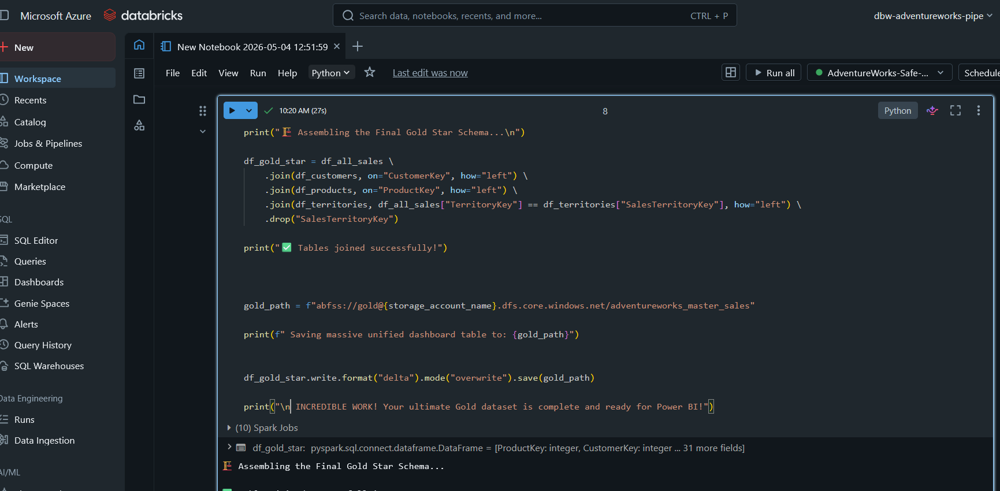

---

## 📊 Business Intelligence (Power BI)

With the heavy lifting complete in the cloud, Power BI was connected directly to the Databricks Lakehouse. 

* The `adventureworks_master_sales` Gold table was imported.
* Custom **DAX columns** were created to calculate `Total Revenue` and `Total Profit`.
* An interactive Executive Summary dashboard was built, featuring KPI cards, Geographic revenue distribution, and Top Product performance.

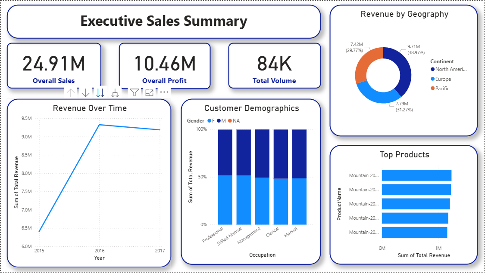

---

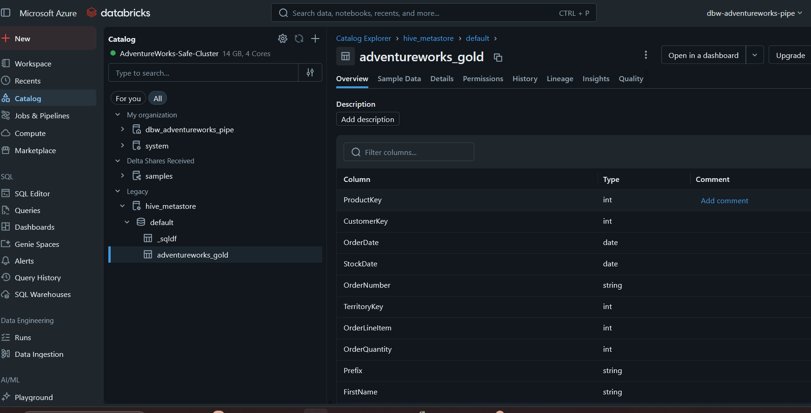
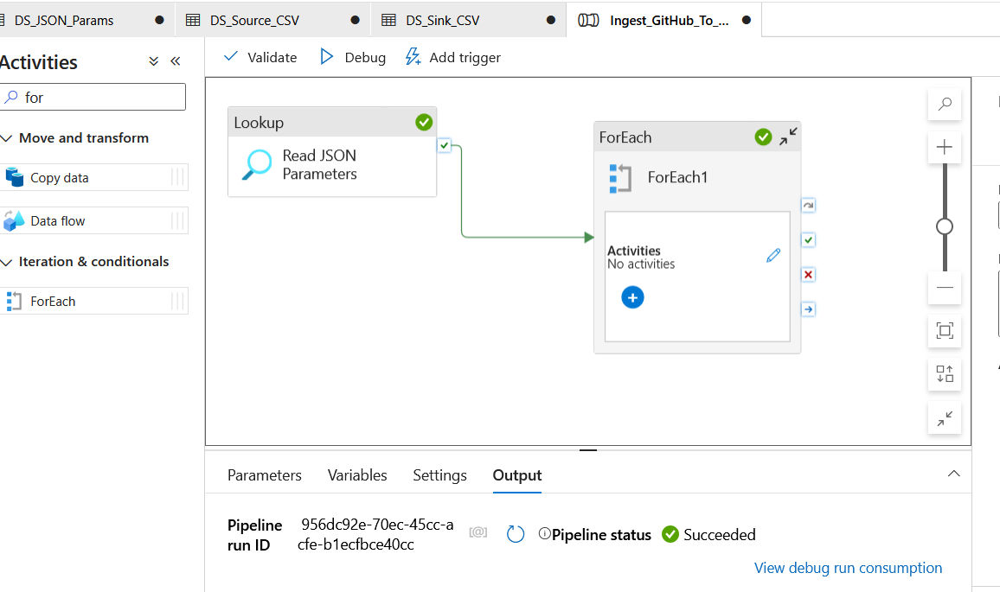
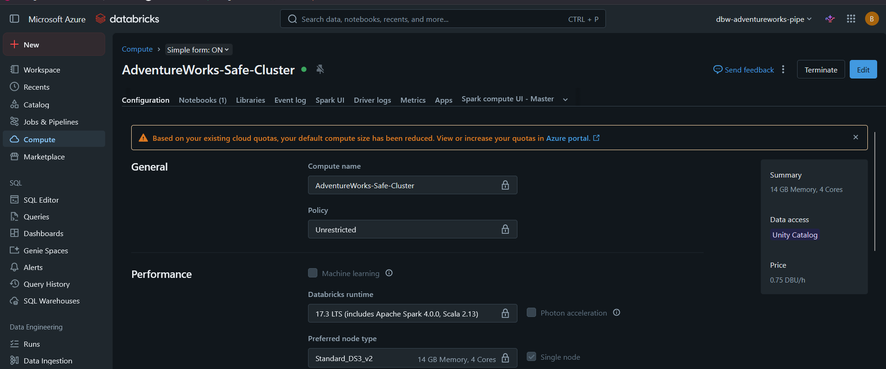
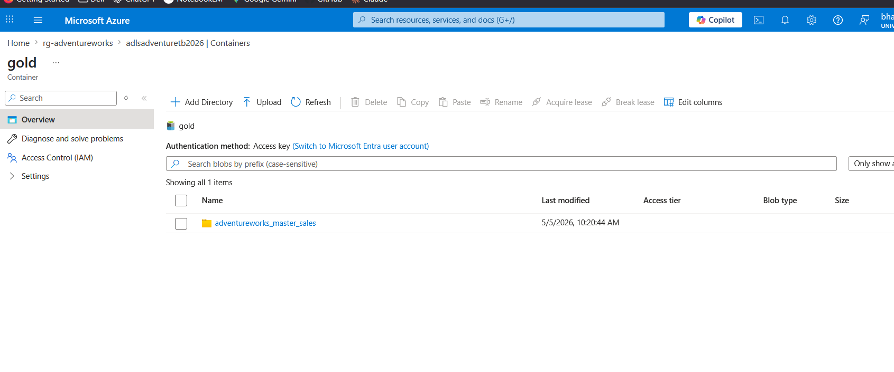
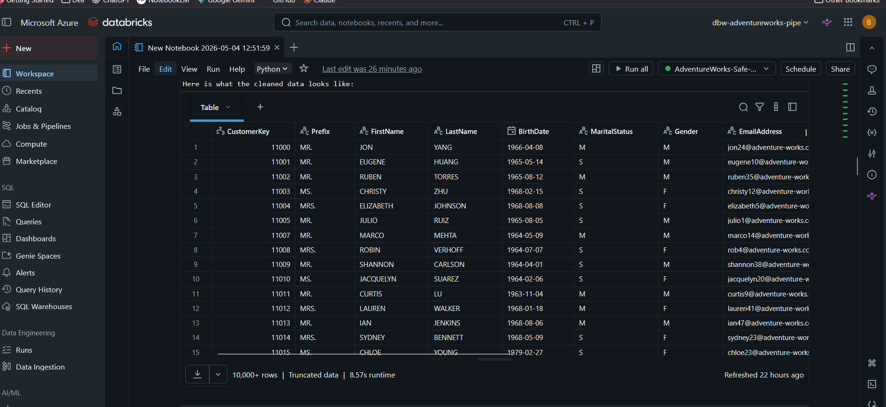
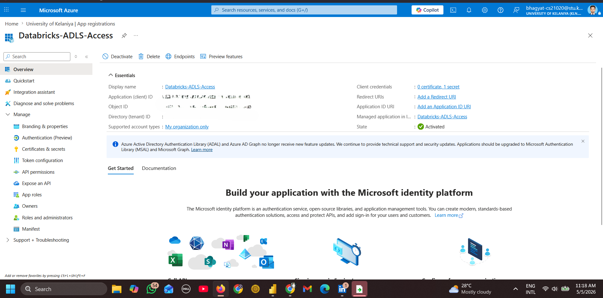
